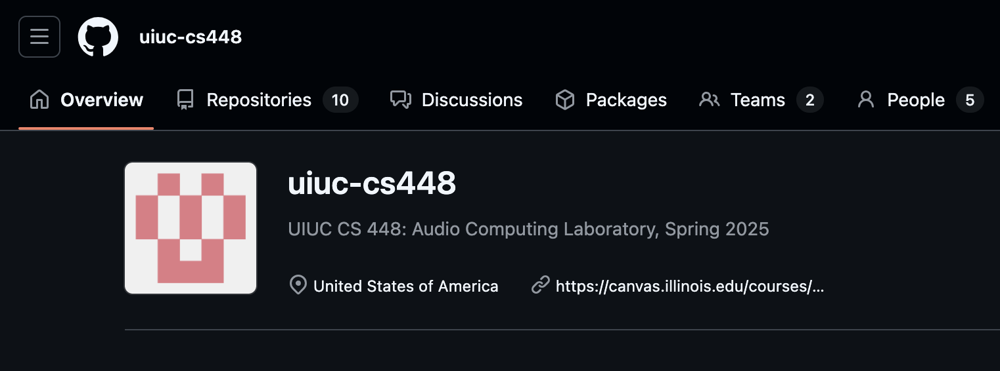
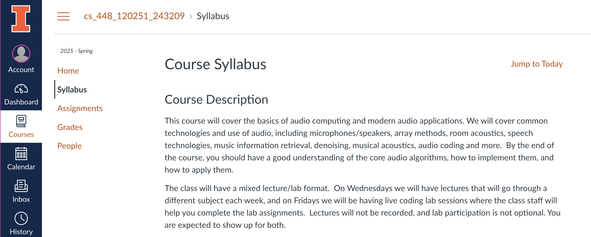
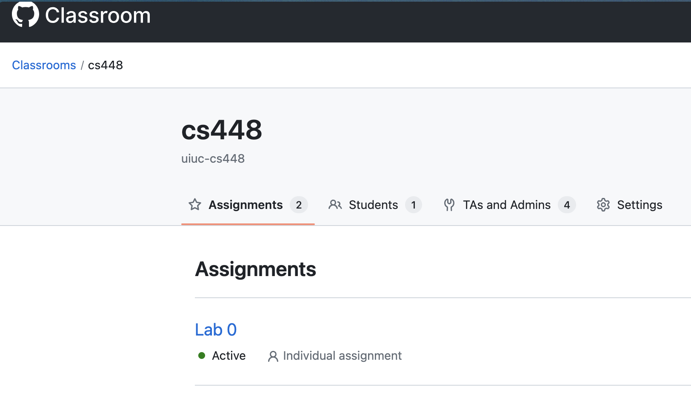
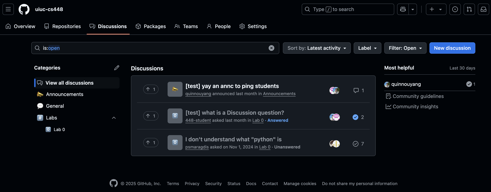

Welcome to Audio Computing Lab! We will be using GitHub Classroom to host our assignments and online discussions. You will receive an invitation to join the GitHub Classroom, which will give you access to all assignments during the semester. You will also receive an invitation to join the course’s GitHub organization page, which is where all online discussion will take place.

Lastly, lecture slides are available through modules on the Canvas page, along with the course syllabus and your lab grades. You really only need Canvas to check on grades and download lecture slides- everything else can be found through the GitHub organization and Classroom.

## Assignments

To access assignments, visit GitHub Classroom and checkout the available labs. If you’ve worked with GitHub repos before and have a preferred IDE, working on labs will feel familiar. You will be provided your own repository of the lab, and your most recent push to this repository will be your “submission” for the lab. As for completing the labs, you will need a local installation of Python to properly run a number of the labs. 

**Important Note:** Do NOT make pull requests to your lab repositories! These requests will make your lab code visible to the entire class, and submitting public code to a lab is a FAIR violation.

## Grading

Grading is done manually by the course staff once a lab deadline has passed. We will evaluate your code and results for each question on a scale from 0-3 depending on whether or not you were able to complete the question. Once your lab has been graded, you will see a score added to your lab’s Jupyter notebook file, and the same score will also be added to Canvas in the Grades tab.

## Extensions

The course staff understands that surprises happen, and sometimes students need more time due to outstanding situations. While we don’t accept late submissions, if you feel like you are in need of an extension, don’t hesitate to reach out privately to course staff.

## Public Discussions

All public discussions will take place in our organization page under Discussions. This is also where we’ll post course announcements, so make sure to keep notifications on for these! 

Discussions can include $LaTeX$, pictures of plots, and audio to help clarify your thoughts. For audio, you will need to convert your files to .mov (add .mov to the end of your audio file) in order for playback to work.

## Private Discussions/Questions

We understand that students might have private questions that they don’t want shared with the rest of the class. Here’s how you can reach us about those:

* For lab-specific private questions, simply create an Issue under the Issues tab of your repo, and tag the course staff with @uiuc-cs448/staff, or individual members of staff by username (@psmaragdis, @ematth, @dbralios, @quinnouyang). 

* For more general questions, (course-related or something outside the scope of a lab or week’s content), add issues to your Lab 0 repository and tag course staff. If you forget and put these questions under a different lab, don’t worry! We’ll still be notified, but keeping these questions in your Lab 0 makes them easier to find later.

## Other Discussion Tidbits:

* Course staff will be staying up to date with GitHub discussions and will try to have your questions answered as soon as humanly possible.
* If you really have to reach out over email, please CC one of the TAs (Evan at evanmm3@illinois.edu, Dimitris at dbralios@illinois.edu)- we’ll try to get to your email as quickly as we can.
* If you specifically need to talk with Prof. Smaragdis, don’t hesitate to ask him before/after/during lecture or lab sessions. 

# Python Setup

> Quinn wrote most of this, read with caution in case he's spouting bs.

There are multiple ways to install and manage Python and the dependencies/libraries you will need for the labs (Jupyter notebooks). Choose your own adventure!

### Before you do anything...

This guide is far from perfect and is written by a Mac + pyenv user. There are 428764824685 StackOverflows and Medium articles on this (also hastily written like this one), so go use them cautiously! But some extra notes:

* Check your installation via which python etc., especially if you have an existing system so you don't accidentally install something on top of it.
* Even with Python seemingly freshly installed, ensure that it is available in your terminal by checking if your OS can "find" its installation location via its PATH variable. You may need to (carefully!) update it, e.g. in the Windows environment variable GUI or Mac/Linux .rc files.
* pls google

## Global Python vs. Multiple Pythons

Fortunately, this class isn’t too picky beyond having Python 3.9 or higher that can the dependencies we listed in requirements.txt. However, dealing with Python is typically apain in the ass. Different projects often require different versions of the same libraries (or even different versions of Python), so organizing them without conflicts is a necessary evil. Pick your poison:

* Global environment: Try to get away with just one version of Python with its dependencies across your OS. This tends to create version conflicts and “bloat” your OS as all projects try to share from an ever-growing environment of dependencies.
* Multiple environments: Switch between different versions of Python and isolate dependencies into “virtual environments” (venv-s). Each project can have its own venv of dependencies so you can edit them without breaking other projects/venvs.

The JavaScript equivalent of a global environment is using one node runtime (Python version) with one node_modules (environment of dependencies) for every project on your computer. It’d be awful.

### Global

If you're on Mac, you could use what macOS preinstalls in /usr/local/bin/, but we recommend not touching that system dependency. Windows and Linux don't have their own Python.

* Install via a OS-specific package manager (useful for installing/managing nearly all software available for your OS). It can reinstall different versions of Python, but you’d still only have one managed version at any moment.
    * Mac: homebrew (very popular! very cool!)
    * Windows: chocolately (kind of popular? not many devs use Windows...)
    * Linux: see your specific distribution (go figure it out, this is your fault)
* Install from python.org (we don't recommend as much: harder to manage/upgrade)

### Multiple

Yay, you chose the right door!

* venv (the other options, this comes native with Python): manage separate environments for dependencies but share the same global Python that you installed from above. Requires a few commands that you can memorize/automate/shortcut.
* pyenv with pyenv-virtualenv: pyenv simultaneously maintains multiple Python versions so you can switch between them and pyenv-virtualenv extends it as a wrapper around venv management (Quinn likes the Real Python guide).
* conda: switch between different environments that also each contain a Python version, unlike pyenv which lets you share a Python version across different venvs (Quinn might be wrong here, he rarely uses conda).

## Installing Dependencies

You can just pip install -r requirements.txt and call it a day, but you risk dumping and forgetting about them until a different Python project wants a different dependency version or your disk is full.

* If you are going global, then just run the above command in the lab dir. All labs share basically the same dependencies, so you usually don't need to do this again.
* If you are using venv-s, etc., consult their documentation. Usually you need to "enter" and environment through your terminal then run pip/conda in that environment to isolate those dependencies.

## IDEs!

Once you clone and open your lab in your favorite IDE, set it up to run Jupyter notebooks. Some popular ones:

* VSCode: Install the ms-toolsai.jupyter extension, then click Select Kernel → Python Environments... → Python 3.X /path/to/python/from/(2).
* JupyterLab (dedicated offline in-browser IDE): Run jupyter lab in the terminal at the repo level, which opens the IDE (http://localhost:...)
* Others (e.g. PyCharm, Spyder): you may need to run jupyter server --no-browser --NotebookApp.alloworigin="*" in the terminal and copy-paste that local server URL into the IDE settings. Follow platform-specific instructions.

> i am sleepy hopefully these docs aren't horrid ok time to twarp
