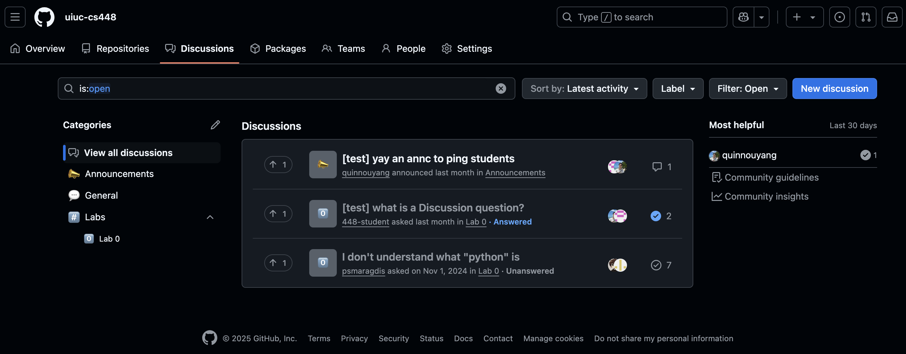
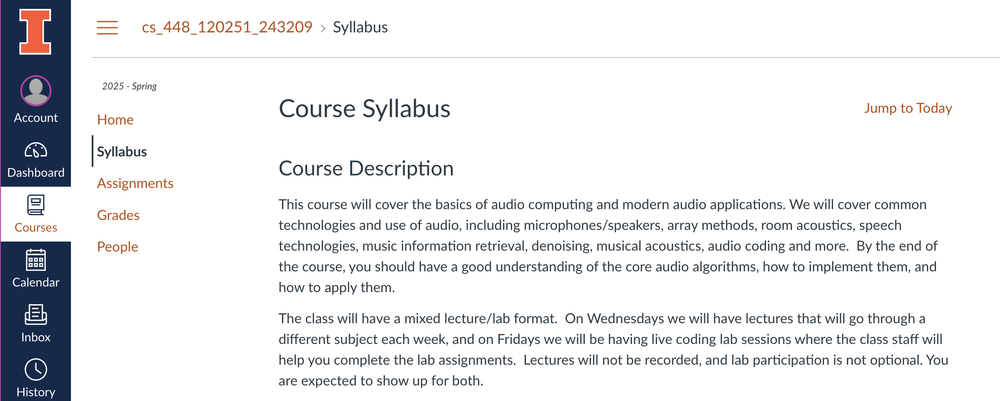
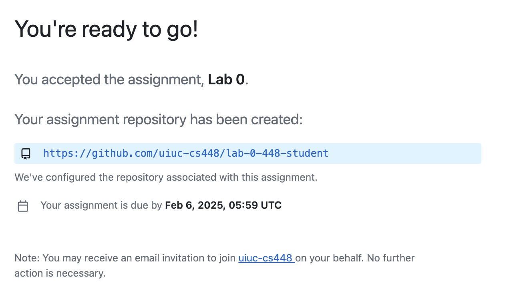
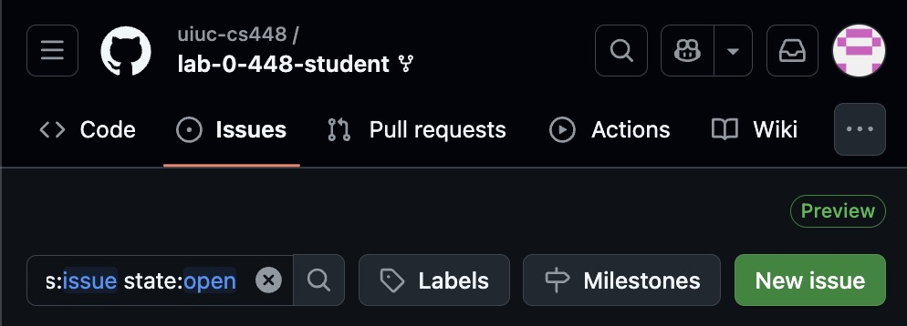

> Course website (this) and GitHub are new and still under construction. Please bear with us and notify us of any issues/suggestions.

| [Discussions](https://github.com/orgs/uiuc-cs448/discussions) | [Canvas](https://canvas.illinois.edu/courses/52926) | [Repositories](https://github.com/orgs/uiuc-cs448/repositories) | [Python Setup](https://uiuc-cs448.github.io/python) |
| ------------------------------------------------------------- | --------------------------------------------------- | --------------------------------------------------------------- | --------------------------------------------------- |

> ℹ️ This website focuses on the **online platforms** of this course to help you onboard. Refer to the syllabus, day-1 lecture slides, announcements, etc. on Canvas for complete coverage on everything else.

Welcome to the website of CS 448 – Audio Computing Laboratory for Spring 2025! Here's a summary of what you'll use:

- **GitHub** for assignments/labs and discussions. You need to accept a internal invitation link (via the Canvas announcement) to have access.
- **Canvas** for the syllabus, lecture slides, and grades. You should automatically have access after registering for the course.

|  |  |
| --------------------------- | ---------------------- |
| _GitHub Discussions page_   | _Canvas syllabus page_ |

# Assignments

> ⚠️ Do not make pull requests (PRs) in your assignment repos! These requests will make your code from an otherwise-private repo visible to the entire class and **submitting public code is a FAIR violation**. (It's a dumb GitHub bug.)

### Access Repositories

Each assignment/lab releases as an internal link to a repo template that you accept, which creates a private fork/copy that **only you and course staff** can read/write to.

> This link-accepting procedure is not final and may change (hopefully we can remove this manual step).

_Confirmation page of receiving your own lab repo as a fork_

### Deadlines

You lose write access to a lab once its deadline arrives, so ensure you commit and push everything by then!

> ℹ️ GitHub does not accept late work/commits, so we grade only what the repo has by the deadline (no "late credit"). However, we understand that circumstances happen so if you believe you should have an extension, [please ask](https://uiuc-cs448.github.io/#private-questionscontact)!

### Grades

Course staff manually grades each lab via a commit to your notebook. We evaluate your code and results for each question on a `0-3` scale depending on how much you completed the question. Once we grade your lab, you should see **a grade and some comments in the top notebook cells** and that same grade on Canvas.

# Discussions

All course discussions/communications will take place in [GitHub Discussions](https://github.com/orgs/uiuc-cs448/discussions). This includes important course announcements so [configure your notifications](https://docs.github.com/en/account-and-profile/managing-subscriptions-and-notifications-on-github/setting-up-notifications/configuring-notifications#about-custom-notifications)! Posts/comments can include $LaTeX$, plots, audio, etc. but **not non-trivial code** for exchanging help about labs, course content, etc. **Go wild! 🎉**

> ℹ️ When attaching an audio file, change the extension to `.mov` before uploading. Otherwise, it won't play! (It's a dumb GitHub bug.)

## Private Questions/Contact

If you have a private question or issue that's not appropriate in Discussions (e.g. requesting an extension), you may contact us via:

### GitHub Issues

Create an issue ([not a PR!](https://uiuc-cs448.github.io/#Assignments)) in a lab repo and **tag us** so we get a notificaation. Since your repo is private to only yourself and course staff, that issue will be too.

- Tag us via `@uiuc-cs448/staff` or if necessary, individually via `@smaragdis`, `@ematth`, `@dbralios`, or `@quinnouyang`
- Issues work best for lab-specific concerns, but default to `Lab 0` for non-lab/other issues.

_GitHub Issues tab for a lab repo_

### Email

If emailing the instructor (`paris@illinois.edu`), please also CC at least one assistant (`ematth@illinois.edu`, `dbralios@illinois.edu`, `qouyang3@illinois.edu`) for wider reachability.

### In-person

Before/after lecture or lab, etc. Just ask us for a private space and time to speak!

> ℹ️ Prefer contacting assistants for most assignment grading/extension or technical platform issues. Prefer contacting the instructor for adminstative tasks, emergencies, etc. (but please still tag/CC an assistant!)
