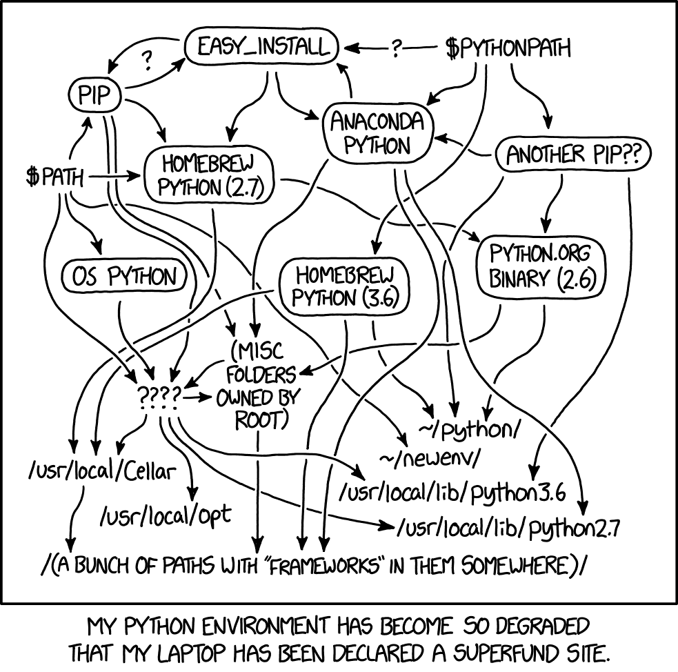

# Python Setup

> This reference is written by a CA who doesn't know everything. Some information can be wrong or incomplete, but that's what Google is for:)

_Necessary [XKCD comic](https://xkcd.com/1987/)_

There are _many_ ways to setup a Python environment and dealing with it can be [a pain in the ass](https://xkcd.com/1987/). Fortunately, this class isn’t too picky beyond having Python 3.9+ with a few dependencies/libraries. If you already have an existing Python setup that you like, you can probably skip to [installing dependencies](https://uiuc-cs448.github.io/python#installing-dependencies).

### Before you do anything...

- Check your installation via `which python` etc., especially if you have an existing system so you don't accidentally install something on top of it.
- Even with Python seemingly freshly installed, ensure that it is available in your terminal by checking if your OS can find its installation location via its `PATH` variable. You may need to (carefully!) update it, e.g. in the Windows environment variable GUI or Mac/Linux `.*rc` files.
- pls google

## Global vs. Multiple Environments

Choose between:

- A global environment: Every project on your computer shares one Python version and uses the **same set of dependencies**. This is easy to start with but hard to maintain as projects require conflicting versions of dependencies.
- Multiple environments: Each project can access a **dedicated, isolated set of dependencies** or even specific Python version. Useful to learn if you often work with Python.

### Global

If you're on Mac, you could use what macOS preinstalls in `/usr/local/bin/`, but we recommend not touching that system dependency to avoid breaking it. Windows and Linux don't have their own Python.

- Install via a OS-specific package manager (useful for installing/managing nearly all software available for your OS). It can reinstall different versions of Python, but you’d still only have one managed version at any moment.
  - Mac: [homebrew](https://brew.sh/) (very popular! very cool!)
  - Windows: [chocolately](https://chocolatey.org/) (kind of popular? not many devs use Windows...)
  - Linux: see your specific distribution (go figure it out, this is your fault)
- Install from [python.org](https://www.python.org/) (we don't recommend as much: harder to manage/upgrade)

### Multiple

Yay, you chose the right door!

- [`venv`](https://docs.python.org/3/library/venv.html) (the other options, this comes native with Python): manage separate environments for dependencies but share the same global Python that you installed from above. Requires a few commands that you can memorize/automate/shortcut.
- [`pyenv`](https://github.com/pyenv/pyenv) with [`pyenv-virtualenv`](https://github.com/pyenv/pyenv-virtualenv): `pyenv` simultaneously maintains multiple Python versions so you can switch between them and `pyenv-virtualenv` extends it as a wrapper around venv management.
- [`conda`](https://docs.conda.io/projects/conda/en/latest/index.html): switch between different environments that also each contain a Python version, unlike pyenv which lets you share a Python version across different venvs (Quinn might be wrong here, he rarely uses conda).
- [`pipenv`](https://pipenv.pypa.io/en/latest/): official recommendation (?) from Python org, seems promising.

## Installing Dependencies

We listed dependencies in each lab repo as a `requirements.txt` file. You can just `pip install -r requirements.txt` and call it a day if you are going global, but if you want to manage a deedicated environment, ensure you're in it first.

- If you are going global, then just run the above command in the lab dir. All labs share basically the same dependencies, so you usually don't need to do this again.
- If you are using `venv`-s, etc., consult their documentation. Usually you need to "enter" and environment through your terminal then run `pip`/`conda` in that environment to isolate those dependencies. All your labs can use the same dedicated environment since they share the same dependencies.

## IDEs!

Once you clone and open your lab in your favorite IDE, set it up to run Jupyter notebooks. Some popular ones:

- [VSCode](https://code.visualstudio.com/docs/datascience/jupyter-notebooks): Install the `ms-toolsai.jupyter` extension, then click `Select Kernel` → `Python Environments...` → `Python 3.X /path/to/python/hopefully`.
- [JupyterLab](https://jupyterlab.readthedocs.io/en/stable/getting_started/starting.html) (dedicated offline in-browser IDE): Run `jupyter lab` in the terminal at the repo level, which opens the IDE (`http://localhost:...`)
- Others (e.g. [PyCharm](https://www.jetbrains.com/help/pycharm/configuring-jupyter-notebook.html), [Spyder](https://docs.spyder-ide.org/current/plugins/notebook.html)): you may need to run `jupyter server --no-browser --NotebookApp.alloworigin="\*"` in the terminal and copy-paste that local server URL into the IDE settings. Follow platform-specific instructions.
